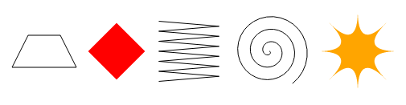

# Chapter 17 - The Canvas Exercises

## 1. Shapes

Write a program that draws the following shapes on a canvas:

- A trapezoid (a rectangle that is wider on one side)
- A red diamond (a rectangle rotated 45 degrees or ¼π radians)
- A zigzagging line
- A spiral made up of 100 straight line segments
- A yellow star



When drawing the last two shapes, you may want to refer to the explanation of `Math.cos` and `Math.sin` in Chapter 14, which describes how to get coordinates on a circle using these functions.

I recommend creating a function for each shape. Pass the position, and optionally other properties such as the size or the number of points, as parameters. The alternative, which is to hardcode numbers all over your code, tends to make the code needlessly hard to read and modify.

```html
<canvas width="600" height="200"></canvas>
<script>
  let cx = document.querySelector("canvas").getContext("2d");

  // Your code here.
</script>
```

## 2. The Pie Chart

Earlier in the chapter, we saw an example program that drew a pie chart. Modify this program so that the name of each category is shown next to the slice that represents it. Try to find a pleasing-looking way to automatically position this text that would work for other datasets as well. You may assume that categories are big enough to leave enough room for their labels.

You might need `Math.sin` and `Math.cos` again, which are described in Chapter 14.

```html
<canvas width="600" height="300"></canvas>
<script>
  let cx = document.querySelector("canvas").getContext("2d");
  let total = results
    .reduce((sum, {count}) => sum + count, 0);
  let currentAngle = -0.5 * Math.PI;
  let centerX = 300, centerY = 150;

  // Add code to draw the slice labels in this loop.
  for (let result of results) {
    let sliceAngle = (result.count / total) * 2 * Math.PI;
    cx.beginPath();
    cx.arc(centerX, centerY, 100,
           currentAngle, currentAngle + sliceAngle);
    currentAngle += sliceAngle;
    cx.lineTo(centerX, centerY);
    cx.fillStyle = result.color;
    cx.fill();
  }
</script>
```

## 3. A Bouncing Ball

Use the `requestAnimationFrame` technique that we saw in Chapter 14 and Chapter 16 to draw a box with a bouncing ball in it. The ball moves at a constant speed and bounces off the box’s sides when it hits them.

```html
<canvas width="400" height="400"></canvas>
<script>
  let cx = document.querySelector("canvas").getContext("2d");

  let lastTime = null;
  function frame(time) {
    if (lastTime != null) {
      updateAnimation(Math.min(100, time - lastTime) / 1000);
    }
    lastTime = time;
    requestAnimationFrame(frame);
  }
  requestAnimationFrame(frame);

  function updateAnimation(step) {
    // Your code here.
  }
</script>
```

## 4. Precomputed Mirroring

One unfortunate thing about transformations is that they slow down the drawing of bitmaps. The position and size of each pixel have to be transformed, and though it is possible that browsers will get cleverer about transformation in the future, they currently cause a measurable increase in the time it takes to draw a bitmap.

In a game like ours, where we are drawing only a single transformed sprite, this is a nonissue. But imagine that we need to draw hundreds of characters or thousands of rotating particles from an explosion.

Think of a way to draw an inverted character without loading additional image files and without having to make transformed `drawImage` calls every frame.