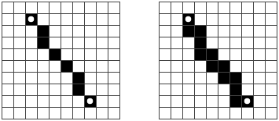

# Chapter 19 - Pixel Editor Exercises

## Keyboard Bindings

Add keyboard shortcuts to the application. The first letter of a tool’s name selects the tool, and ctrl-Z or command-Z activates undo.

Do this by modifying the `PixelEditor` component. Add a `tabIndex` property of 0 to the wrapping `<div>` element so that it can receive keyboard focus. Note that the property corresponding to the `tabindex` attribute is called `tabIndex`, with a capital I, and our `elt` function expects property names. Register the key event handlers directly on that element. This means you have to click, touch, or tab to the application before you can interact with it with the keyboard.

Remember that keyboard events have `ctrlKey` and `metaKey` (for command on Mac) properties that you can use to see whether those keys are held down.

```html
<div></div>
<script>
  // The original PixelEditor class. Extend the constructor.
  class PixelEditor {
    constructor(state, config) {
      let {tools, controls, dispatch} = config;
      this.state = state;

      this.canvas = new PictureCanvas(state.picture, pos => {
        let tool = tools[this.state.tool];
        let onMove = tool(pos, this.state, dispatch);
        if (onMove) {
          return pos => onMove(pos, this.state, dispatch);
        }
      });
      this.controls = controls.map(
        Control => new Control(state, config));
      this.dom = elt("div", {}, this.canvas.dom, elt("br"),
                     ...this.controls.reduce(
                       (a, c) => a.concat(" ", c.dom), []));
    }
    syncState(state) {
      this.state = state;
      this.canvas.syncState(state.picture);
      for (let ctrl of this.controls) ctrl.syncState(state);
    }
  }

  document.querySelector("div")
    .appendChild(startPixelEditor({}));
</script>
```

## Efficient Drawing

During drawing, the majority of work that our application does happens in `drawPicture`. Creating a new state and updating the rest of the DOM isn’t very expensive, but repainting all the pixels on the canvas is quite a bit of work.

Find a way to make the `syncState` method of `PictureCanvas` faster by redrawing only the pixels that actually changed.

Remember that `drawPicture` is also used by the save button, so if you change it, either make sure the changes don’t break the old use or create a new version with a different name.

Also note that changing the size of a `<canvas>` element, by setting its `width` or `height` properties, clears it, making it entirely transparent again.

```html
<div></div>
<script>
  // Change this method
  PictureCanvas.prototype.syncState = function(picture) {
    if (this.picture == picture) return;
    this.picture = picture;
    drawPicture(this.picture, this.dom, scale);
  };

  // You may want to use or change this as well
  function drawPicture(picture, canvas, scale) {
    canvas.width = picture.width * scale;
    canvas.height = picture.height * scale;
    let cx = canvas.getContext("2d");

    for (let y = 0; y < picture.height; y++) {
      for (let x = 0; x < picture.width; x++) {
        cx.fillStyle = picture.pixel(x, y);
        cx.fillRect(x * scale, y * scale, scale, scale);
      }
    }
  }

  document.querySelector("div")
    .appendChild(startPixelEditor({}));
</script>
```

## Circles

Define a tool called `circle` that draws a filled circle when you drag. The center of the circle lies at the point where the drag or touch gesture starts, and its radius is determined by the distance dragged.

```html
<div></div>
<script>
  function circle(pos, state, dispatch) {
    // Your code here
  }

  let dom = startPixelEditor({
    tools: {...baseTools, circle}
  });
  document.querySelector("div").appendChild(dom);
</script>
```

## Proper Lines

This is a more advanced exercise than the preceding three, and it will require you to design a solution to a nontrivial problem. Make sure you have plenty of time and patience before starting to work on this exercise, and don’t get discouraged by initial failures.

On most browsers, when you select the `draw` tool and quickly drag across the picture, you don’t get a closed line. Rather, you get dots with gaps between them because the `"mousemove"` or `"touchmove"` events did not fire quickly enough to hit every pixel.

Improve the `draw` tool to make it draw a full line. This means you have to make the motion handler function remember the previous position and connect that to the current one.

To do this, since the pixels can be an arbitrary distance apart, you’ll have to write a general line drawing function.

A line between two pixels is a connected chain of pixels, as straight as possible, going from the start to the end. Diagonally adjacent pixels count as connected. A slanted line should look like the picture on the left, not the picture on the right.



Finally, if we have code that draws a line between two arbitrary points, we might as well use it to also define a `line` tool, which draws a straight line between the start and end of a drag.

```html
<div></div>
<script>
  // The old draw tool. Rewrite this.
  function draw(pos, state, dispatch) {
    function drawPixel({x, y}, state) {
      let drawn = {x, y, color: state.color};
      dispatch({picture: state.picture.draw([drawn])});
    }
    drawPixel(pos, state);
    return drawPixel;
  }

  function line(pos, state, dispatch) {
    // Your code here
  }

  let dom = startPixelEditor({
    tools: {draw, line, fill, rectangle, pick}
  });
  document.querySelector("div").appendChild(dom);
</script>
```